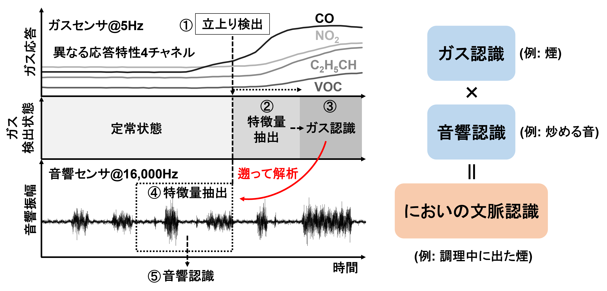
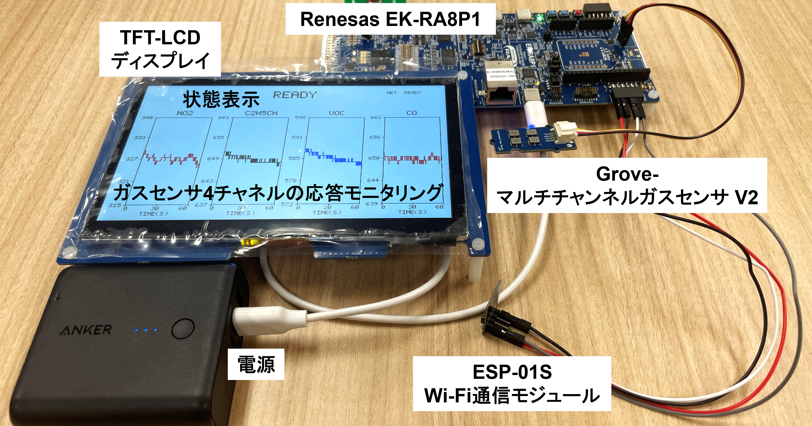

# Scentext

### 〜音で遡る「においの文脈」リアルタイム認識システム〜

TRONプログラミングコンテスト2026 応募プログラム。

ガスセンサの立上りを**低負荷で常時監視**し、特定ガスを検知した瞬間だけ、直近の音響データを
**時間を遡って**参照し高負荷なNPU推論を行うイベント駆動型のマルチモーダル・エッジAI。
Renesas EK-RA8P1上で、独立した2つのμT-Kernel 3.0インスタンスを使って実現。

ガスセンサ単体では「何が原因でそのガスが検知されたか」という発生背景（文脈）までは特定できない。
Scentextは、応答の遅いガス情報に対して瞬時に消える音の情報を遡って紐づけることで、
「においの文脈」を認識する。エッジAIとして動作し、プライバシーへの配慮や通信負荷の低さを保ったまま、常時監視と省電力を両立する。



## 対応環境

| 項目 | 内容 |
|---|---|
| マイコンボード | Renesas EK-RA8P1(Cortex-M85 @ 1GHz + Cortex-M33 @ 250MHz + Ethos-U55 NPU) |
| RTOS | μT-Kernel 3.0(mtk3_bsp2) — 2コアそれぞれに独立インスタンス |
| IDE | Renesas e2studio(FSP、LLVMツールチェーン) |
| ガスセンサ | Grove - Multichannel Gas Sensor V2(I2C、NO2/C2H5CH/VOC/CO 4ch) |
| 音響センサ | EK-RA8P1搭載 PDM方式デジタルMEMSマイク |
| 表示 | EK-RA8P1付属 7インチ TFT-LCD(1024×600、GLCDC) |
| 通信 | ESP-01S(ATコマンドファームウェア、UART/PMOD2経由)+ [ntfy.sh](https://ntfy.sh/) によるプッシュ通知 |

配線・起動手順は[`doc/Scentext_応募作品操作マニュアル.pdf`](doc/Scentext_応募作品操作マニュアル.pdf)を参照。



## デモ動画

紹介資料(`doc/Scentext_応募作品紹介資料.pptx`)pp.11-13の実演動画。

- [デモ結果① スプレー(水 vs アルコール)](https://youtu.be/4oaNcdFGCXA)
- [デモ結果② アルコールを湿らせた紙](https://youtu.be/nnyO5X-fEu4)
- [デモ結果③ 呼気の吹きかけ](https://youtu.be/4pa7zj7xIqU)

## システム構成

GLCDC描画とI2Cガスセンサ読み取りを同一コアで行うとバス競合が起きることが実測でわかったため、
表示を別コアへ完全分離し、**両コアそれぞれが独立したμT-Kernel 3.0インスタンス**を持つ構成にした。

| コア | 役割 |
|---|---|
| Cortex-M85(`CPU0/`) | ガスセンサ読み取り+ガス推論、PDM音響サンプリング+MFCC/NPU音響推論 |
| Cortex-M33(`CPU1/`) | TFT-LCD表示、Wi-Fi経由のプッシュ通知(ntfy.sh) |

コア間はガスデータ・状態を固定物理アドレスの共有メモリ(IPC)経由で受け渡す。

「リアルタイム性が必須の処理」と「遅延が許容できるベストエフォートI/O」を明確に分けるという
設計思想は、CPU0・CPU1間の役割分担だけでなくCPU1コア内にも適用しており、通信タスクの
優先度を表示タスクよりも低く設定している(ネットワークI/Oのブロッキング処理が表示の
描画タイミングに影響しないようにするため)。また、表示と通信を独立したタスクとして
分離しているため、実運用時に消費電力の大きい表示を省略しても、検知結果を人に伝える手段(通知)は独立して機能する。

### タスク構成

| コア | タスク | 優先度 | 役割 |
|---|---|---|---|
| CPU0 | `task_gas` | 10(高) | I2Cガス読み取り(200ms周期)、ガス推論、IPC書き込み |
| CPU0 | `task_audio` | 11 | PDM音響サンプリング、ガス連動の音響推論 |
| CPU1 | `task_display` | 12 | GLCDC描画(200ms周期) |
| CPU1 | `task_net` | 13(低) | ガス+音響の判定確定を検知し、ntfy.shへプッシュ通知を送信 |

`task_gas`の方を高優先度にしているのは、ガス読み取りは1サイクルが短く200ms周期を
絶対に守る必要がある一方、`task_audio`のMFCC/NPU推論は数百ms〜と重く厳密な締め切りが
無いため。PDMの生サンプリング自体はDMAC割込み(どのタスク優先度よりも常に優先される)
で保護されているので、この優先度設定でサンプリング取りこぼしが増えることはない。

詳細なタスク仕様・ステータス管理・IPC構造体は[`doc/ソフトウェア仕様書.md`](doc/ソフトウェア仕様書.md)を参照。

## ビルド・書き込み

`CPU0/`・`CPU1/`はそれぞれ独立したe2studioプロジェクト。両方をワークスペースへ
インポートしてビルドする必要がある。

1. Wi-Fi通知機能を使う場合、`CPU1/src/esp_notify.c`冒頭の`WIFI_SSID`/`WIFI_PASSWORD`を
   実際のWi-Fi環境の値に書き換える(2.4GHz帯のネットワークであること。ESP8266は
   5GHz帯に非対応)。`NTFY_TOPIC`も、他人と重複しない任意の文字列に変更することを推奨
   (ntfy.shは公開トピック方式のため、トピック名を知っていれば誰でも購読・受信できる)
2. e2studioで`CPU0`・`CPU1`の両プロジェクトをインポートし、それぞれビルド
3. EK-RA8P1をPCに接続し、`CPU1/dual_core Debug_Multicore Launch Group.launch`を
   実行する。これはCPU0・CPU1両方のイメージをまとめてボードへ書き込む
   マルチコア用のデバッグ構成で、書き込み後は自動的にリセット・実行開始する
   (CPU0がCPU1を起動する構成のため、両方が書き込まれていないとディスプレイが起動しない)
4. 電源投入(またはリセット)後、数百ms以内にTFT-LCDにグラフ表示が始まる

実行プログラムはマイコンボードのフラッシュ(MRAM)に書き込まれるため、**書き込み後は
デバッガ・PCを接続したままにする必要はない**。一度書き込めば、以後は電源を入れる
(またはリセットする)だけでボード単体で動作する。起動後の詳しい挙動(ウォームアップ
待ち時間等)は[`doc/Scentext_応募作品操作マニュアル.pdf`](doc/Scentext_応募作品操作マニュアル.pdf)を参照。

## リポジトリ構成

```
Scentext/
├── README.md
├── LICENSE / NOTICE.md
├── CPU0/              # Cortex-M85側 e2studioプロジェクト(ガス+音響サンプリング・推論)
├── CPU1/              # Cortex-M33側 e2studioプロジェクト(TFT-LCD表示+Wi-Fi通知)
└── doc/
    ├── ソフトウェア仕様書.md      # タスク構成・IPC設計・ステータス管理・パラメータ一覧
    ├── Scentext_応募作品操作マニュアル.pdf  # 実機の起動手順・動作確認方法
    ├── Scentext_応募作品紹介資料.pptx      # 紹介資料(動画付き)
    └── Scentext_応募作品計画書.pdf
```

## ライセンス

オリジナルコード([`CPU0/src/`](CPU0/src/)・[`CPU1/src/`](CPU1/src/)・`doc/`)は
[Apache License 2.0](LICENSE)。同梱しているRenesas FSP・μT-Kernel 3.0 BSP等の
ベンダーコードについては[`NOTICE.md`](NOTICE.md)を参照。
