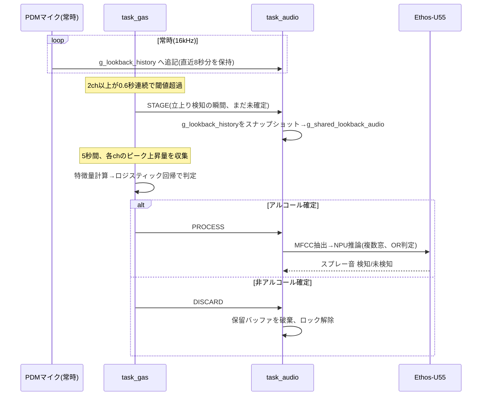

# ソフトウェア仕様書

## 1. 全体構成

Renesas EK-RA8P1(Cortex-M85 + Cortex-M33 + Ethos-U55 NPU)上で、μT-Kernel 3.0の
**独立した2インスタンス**をそれぞれのコアに搭載する構成。SMPではなく、各コアが
それぞれ独立にカーネルを起動・管理する。

| コア | 役割 | μT-Kernelインスタンス |
|---|---|---|
| Cortex-M85(CPU0) | ガスセンサ読み取り+ガス推論、PDM音響サンプリング+MFCC/NPU音響推論 | 独立インスタンス#1 |
| Cortex-M33(CPU1) | TFT-LCD(GLCDC)表示、Wi-Fi経由のプッシュ通知(ESP-01S+ntfy.sh) | 独立インスタンス#2 |

起動順序: CPU0の`hal_entry()`が`R_BSP_SecondaryCoreStart()`でCPU1を起こした**後**、
CPU0自身が`knl_start_mtkernel()`を呼ぶ(この関数は戻らないため、順序を誤ると
CPU1が永久に起動しない)。CPU1は起こされた直後に自分自身の`knl_start_mtkernel()`を
呼び出すのみ。

コア間通信は、固定物理アドレス(`0x220E9000`)へのポインタキャストによる共有メモリ
(セクション機構を経由しない)。CPU0のRAM末尾から4KB手前にあたり、通常のリンカ配置
(.bss/.data/heap/stack)がここまで伸びてこない前提で運用している。

## 2. タスク構成

### CPU0(Cortex-M85)

| タスク名 | 優先度 | スタック | 周期/起動契機 | 役割 |
|---|---|---|---|---|
| `task_gas` | 10(高) | 2048B | 200ms周期 | I2Cガスセンサ読み取り、ガス推論、IPC書き込み |
| `task_audio` | 11 | 4096B | 常時ループ | PDM音響サンプリング、ガス連動の音響推論 |

優先度は数値が小さいほど高い。`task_gas`を高優先度にしているのは、1サイクルが短く
200ms周期を絶対に守る必要がある一方、`task_audio`のMFCC/NPU推論は数百ms〜と重く
厳密な締め切りが無いため。逆(音声側を高優先度)にすると、推論実行中ずっとガス側が
飢餓状態になり、200ms周期のサンプリングが止まってしまう。

なお、PDMの生サンプリング自体(`my_pdm_loop_callback()`)はDMAC割込みで行われており、
これはどのタスクの優先度よりも常に優先されるため、`task_audio`自体の優先度を下げても
サンプリング取りこぼしのリスクは増えない。

### CPU1(Cortex-M33)

| タスク名 | 優先度 | スタック | 周期 | 役割 |
|---|---|---|---|---|
| `task_display` | 12 | 8192B | 200ms周期(`GAS_SAMPLE_INTERVAL_MS`) | GLCDC描画(ガス4chグラフ+ステータス表示) |
| `task_net` | 13(低) | 4096B | 300ms周期 | ガス+音響の判定確定を検知しntfy.shへプッシュ通知 |

`task_net`は`task_display`より優先度を低くしてあり、ネットワークI/O(ブロッキングする
ATコマンド送受信)が表示の描画タイミングに影響しないようにしている。

## 3. コア間IPC(共有メモリ)

`ipc_shared.h`(CPU0/CPU1で内容を完全に一致させる必要がある。片方だけ変更すると
構造体レイアウトがずれて壊れるため、変更時は両方に同じ変更を適用すること)。

```c
typedef struct {
    uint32_t seq;               // CPU0が1サンプル書き込むごとに+1(CPU1側の更新検知用)
    int32_t  no2;
    int32_t  c2h5ch;
    int32_t  voc;
    int32_t  co;
    uint32_t any_rising;        // READY/WAIT表示用の"busy"フラグ(下記4.1参照)
    uint32_t gas_line2_state;   // gas_line2_state_t(下記4.2)
    uint32_t gas_line2_seconds; // 収集中/結果表示中の残り秒数(切り上げ)
    uint32_t audio_state;       // audio_status_state_t(下記4.3)
    uint32_t audio_percent;     // 音響認識の確率(%)
    uint32_t audio_seconds;     // 結果表示中の残り秒数(切り上げ)
    uint32_t warming_up;        // ガスセンサーのヒーターがまだウォームアップ中なら1
    uint32_t wifi_scan_seq;     // CPU1(esp_notify.c)が診断メッセージを書き込むたびに+1
    char     wifi_scan_text[600]; // Wi-Fiスキャン結果/診断メッセージ(ヌル終端)
} gas_ipc_shared_t;

#define IPC_SHARED_ADDR (0x220E9000UL)
#define g_gas_ipc (*(volatile gas_ipc_shared_t *)IPC_SHARED_ADDR)
```

CPU0の`task_gas`が200msごとに全フィールドを書き込み、CPU1の`task_display`が
同じ周期で読み出して描画する。`wifi_scan_seq`/`wifi_scan_text`はCPU1(esp_notify.c)から
CPU0への逆方向の中継用で、CPU1にはデバッグ用UARTが無いため、Wi-Fi接続失敗時の
診断メッセージ(AT+CWLAPのスキャン結果等)をCPU0の既存コンソール(Tera Term)へ
中継出力するために使う(詳細は下記4.5)。

## 4. ステータス管理

### 4.1 ガス立上り状態(チャンネルごと)

`gas_recognition.c`内、チャンネル(NO2/C2H5CH/VOC/CO)ごとに独立したスロープ計算+
立上り判定を行う。

- 直近`GAS_SLOPE_LOOKBACK_SAMPLES`(13サンプル≒2.6秒)の傾き(count/s)を計算
- 傾きが閾値(`GAS_RISE_THRESH`=4.0、ただしCOのみ過敏なため`GAS_RISE_THRESH_CO`=6.0)を
  超える状態が`GAS_RISE_CONFIRM_SAMPLES`(3サンプル=0.6秒)続けば`RISING`
- 閾値を下回る状態が`GAS_EXIT_CONFIRM_SAMPLES`(25サンプル=5.0秒)続けば`NOT_RISING`に復帰

**単独チャンネルの誤検知対策として、同時に`RISING`のチャンネル数が2以上の場合のみ
「立上り」(`any_rising`)と判定する**(1チャンネルだけの反応は無視)。

`any_rising`(IPC送信値)は、この物理的な立上り判定に加えて、下記4.2/4.3の状態が
IDLEでない間も1になる(解析・結果表示中にREADY表示へ戻ってしまうのを防ぐため)。

### 4.2 ガス推論表示状態: `gas_line2_state_t`

CPU1のステータス2行目("[GAS] ANALYZING.. (Ns LEFT)"等)に対応。

| 値 | 名称 | 意味 |
|---|---|---|
| 0 | `GAS_LINE2_IDLE` | 何も表示しない |
| 1 | `GAS_LINE2_COLLECTING` | 立上り確認後、POST_WINDOW(5秒)分のピークデータ収集中 |
| 2 | `GAS_LINE2_RESULT_ALCOHOL` | アルコール確定、結果表示中(5秒) |
| 3 | `GAS_LINE2_RESULT_CLEAR` | 非アルコール確定、結果表示中(2秒、誤検知時は早くREADYへ戻す) |
| 4 | `GAS_LINE2_RISING_DETECTED` | 立上り検知直後1秒間だけの速報表示(COLLECTINGの先頭部分) |

### 4.3 音響推論表示状態: `audio_status_state_t`

CPU1のステータス3行目("[AUDIO] SPRAY DETECTED N%"等)に対応。

| 値 | 名称 | 意味 |
|---|---|---|
| 0 | `AUDIO_STATUS_IDLE` | 何も表示しない |
| 1 | `AUDIO_STATUS_ANALYZING` | MFCC+NPU推論実行中 |
| 2 | `AUDIO_STATUS_RESULT_SPRAY` | スプレー音検知、結果表示中(5秒) |
| 3 | `AUDIO_STATUS_RESULT_NONE` | スプレー音未検知、結果表示中(5秒) |

### 4.4 ガス↔音響 連携シグナル: `gas_audio_signal_t`(`gas_recognition.h`)

`gas_recognition.c`(CPU0)から`audio_task.c`(CPU0、同一コア内、別タスク)への通知。

| 値 | 名称 | 意味 |
|---|---|---|
| 0 | `GAS_AUDIO_SIGNAL_NONE` | 通常状態 |
| 1 | `GAS_AUDIO_SIGNAL_STAGE` | 立上り検知の瞬間にセット。音声側は直近の音声を保留バッファへ抽出するだけ(推論はまだ) |
| 2 | `GAS_AUDIO_SIGNAL_PROCESS` | ガス推論でアルコール確定。音声側は保留バッファに対しMFCC/NPU推論を実行 |
| 3 | `GAS_AUDIO_SIGNAL_DISCARD` | ガス推論で非アルコール確定。音声側は保留バッファを破棄しロック解除 |

保留バッファ(`g_shared_lookback_audio`)は、STAGE→PROCESS/DISCARDが確定するまで
上書きされないことを`g_staging_locked`フラグで保証する。



立上り検知(STAGE)からアルコール確定/非確定(PROCESS/DISCARD)までは、
特徴量収集のための`GAS_POST_SAMPLES`(5.0秒)がそのままかかる。音声側は
この間、STAGEで確保したスナップショットを保持したまま待機するだけで、
実際のMFCC/NPU推論はPROCESS確定後に初めて実行する。

### 4.5 通知送信状態: `esp_notify_status_t`(`esp_notify.h`、CPU1)

CPU1のNETステータス表示("NET: READY"等)に対応。CPU1にはデバッグ用UARTが無いため、
どの段階で失敗したかを画面表示だけで切り分けられるよう、状態を細かく分けてある。

| 値 | 名称 | 意味 |
|---|---|---|
| 0 | `ESP_NOTIFY_STATUS_BOOT` | 起動直後、AT初期化前 |
| 1 | `ESP_NOTIFY_STATUS_AT_FAIL` | "AT"コマンド自体に応答が無い(配線/ボーレート/モジュール自体の問題) |
| 2 | `ESP_NOTIFY_STATUS_JOINING` | AT応答は取れた。Wi-Fi接続中 |
| 3 | `ESP_NOTIFY_STATUS_READY` | Wi-Fi接続済み、送信待ち |
| 4 | `ESP_NOTIFY_STATUS_SENDING` | 通知送信中 |
| 5 | `ESP_NOTIFY_STATUS_SENT` | 直近の送信が成功(5秒後READYへ自動復帰) |
| 6 | `ESP_NOTIFY_STATUS_JOIN_FAIL` | AT応答は取れたが、Wi-Fi接続(AT+CWJAP)に失敗 |
| 7 | `ESP_NOTIFY_STATUS_SEND_FAIL` | Wi-Fi接続済みだが、直近の通知送信に失敗(5秒後READYへ自動復帰) |

`task_net`は、ガス側ALCOHOL確定(`gas_line2_state==2`)の立ち上がりで「音声側の結果待ち」
状態に入り、音声側が結果確定(`audio_state==2`スプレー音検知 または `==3`未検知)するまで
待ってから、その結果を本文に含めて`esp_notify_send()`を1回だけ呼ぶ。

`esp_notify_send()`は、呼び出し時点の状態が`AT_FAIL`/`JOIN_FAIL`/`SEND_FAIL`のいずれかで
あれば、送信前にまず再接続(AT疎通確認→`AT+CWJAP`再実行)を試みる。これにより、
Wi-Fiが途中で切断された場合も、次に送信が必要になったタイミングで自動的に復帰する。

通知はESP-01S(ATコマンドファームウェア)をUART(PMOD2、SCI0、115200bps)経由で操作し、
[ntfy.sh](https://ntfy.sh/)へ平文HTTP(TLS/SSL不使用)でPOSTする方式。Wi-Fi接続失敗時は
`AT+CWLAP`で周辺アクセスポイントをスキャンし、結果を`wifi_scan_seq`/`wifi_scan_text`
経由でCPU0コンソールへ中継する(目的のSSIDがそもそも見えているかを確認するため)。

## 5. ガス推論アルゴリズム(`gas_recognition.c`)

1. 立上り検知(4.1)の瞬間、直近`GAS_BASE_SAMPLES`(50サンプル=10秒)の各チャンネル平均を
   ベースラインとして記録し、収集(`g_collecting`)を開始
2. `GAS_POST_SAMPLES`(25サンプル=5.0秒、学習時の`GAS_MODEL_POST_WINDOW_SEC`と一致)分、
   各チャンネルの「ベースラインからの最大上昇量(peak_rise)」とそのタイミングを追跡
3. 収集完了時、特徴量ベクトル(4チャンネルの上昇量比率、CO基準の相対タイミング、
   合計上昇量の対数)を`gas_recognition_model.h`の学習済み線形モデルに入力し、
   ロジットからアルコール/非アルコールを判定
4. アルコール確定時: onsetから合計10秒(`GAS_COOLDOWN_SAMPLES`)のクールダウンに入り、
   次の立上り検知を一時抑制。非アルコール確定時はクールダウンなし(即座に次を検知可能)

### 5.1 ヒーターのウォームアップ検知

MOX(金属酸化物半導体)式ガスセンサは、素子をヒーターで目標温度まで加熱して初めて
ガス分子に反応する。電源投入直後はヒーターが温まりきっておらず、この間は出力と
ガス濃度の対応関係(センサ特性)自体が確立されていないため、この間の傾きの変化を
立上りとして拾うと誤検知の原因になる。

実測ログ(`dataset/gas/heating/*.csv`)から、NO2チャンネルが他チャンネルより早く
スロープ0付近に収束することを確認しているため、NO2チャンネルの傾きを使って
ウォームアップ完了を判定する。

- NO2チャンネルの傾きの絶対値が`GAS_WARMUP_SLOPE_THRESH`(1.0 count/s)未満の
  サンプルで蓄積カウンタを+1、以上のサンプルで-1(0未満にはしない)する
  **リーキーバケット方式**を採用
- 蓄積カウンタが`GAS_WARMUP_CONFIRM_SAMPLES`(287サンプル=57.4秒)に達したら
  `g_warmup_done=1`とし、以後`gas_recognition_is_warming_up()`は0を返す
  (IPCの`warming_up`フィールドに反映)
- ウォームアップ完了までは、`any_rising`の判定自体を行わない(立上り検知を無効化)
- 理論上の最短解除時間は、傾き計算に必要な最小データが揃うまでの時間(2.6秒)+
  蓄積時間(57.4秒)で約60秒。ノイズの多い個体や真の冷えきり状態では、
  カウンタの増減が閾値付近で揺れるため自然と長くなる(実測6ログで60〜305秒)

## 6. 音響推論アルゴリズム(`audio_task.c` / `audio_mfcc.c`)

### 6.1 音声キャプチャ

PDM(1chマイク、16kHz)をDMAC経由で連続キャプチャ。ハードウェア制約
(PDM/DMACの転送が32bit固定)により、生データの受け皿(`sound_buffer_A/B`)は
`DMAC_CHUNK_SAMPLES`(1024サンプル)単位の小さいint32スクラッチとし、DMAC1チャンク
完了ごとに`my_pdm_loop_callback()`内でint16へ変換して、`LOOKBACK_SECONDS`秒分
(既定8秒)の循環リング`g_lookback_history`(int16)へ追記していく。

### 6.2 遡り抽出(スナップショット)

ガス立上り検知(STAGE)のタイミングで、`g_lookback_history`の
直近`LOOKBACK_TOTAL_SAMPLES`分を時系列順に並べ直し、凍結スナップショット
`g_shared_lookback_audio`へコピーする(以後、推論が終わるまでこのコピーは変化しない)。

### 6.3 複数窓分割によるMFCC/NPU推論

モデルの入力窓は`REC_SECONDS`=5秒固定(学習時と同じ)。`LOOKBACK_SECONDS`が
5秒より長い場合、`run_audio_mfcc_multiwindow()`が以下の分割を行う。

- 窓数 `K = ceil(LOOKBACK_TOTAL_SAMPLES / TOTAL_SAMPLES)`
- 各窓の開始位置は `offset(i) = (LOOKBACK_TOTAL_SAMPLES - TOTAL_SAMPLES) * i / (K - 1)`
  (先頭窓は必ずbuf[0]から、末尾窓は必ずバッファの最後の5秒分をちょうどカバー)
- 各窓についてMFCC(N_FFT=512, HOP_LENGTH=256, N_MELS=40, N_MFCC=10, 311フレーム)を
  計算し、Ethos-U55 NPUで推論(`audio_run_inference()`)
- いずれか1窓でも確率>0.5なら全体を「スプレー音検知」とする(OR判定)。表示用の確率は
  全窓中の最大値を採用

MFCC計算(CMSIS-DSPの`arm_mfcc_f32()`、内部のFFTは`arm_rfft_fast_f32`/`arm_cfft_f32`)は、
`ARM_MATH_MVEF`を有効化してArm Helium(MVE、Cortex-M85のSIMD拡張)最適化パスでビルドしている。

例: `LOOKBACK_SECONDS=8` → K=2(先頭5秒+末尾5秒、2秒分重複)、`LOOKBACK_SECONDS=12` → K=3。

## 7. CPU1: GLCDC表示

- 1024×600、32bit RGB、ダブルバッファ
- ガス4チャンネル(NO2/C2H5CH/VOC/CO)を横4分割で折れ線グラフ表示
  - Y軸: 5等分目盛り、Python版と同じ「余白=max(範囲の10%, 5)」ロジックでスパイクが
    枠に張り付かないようスケーリング
  - X軸: 常時監視用途のため絶対経過時間ではなく現在表示中ウィンドウ内の相対秒数
    (小数点第一位まで、0の場合は省略)。ウィンドウ幅は`GAS_WINDOW_MS`(既定60秒)
  - 静的要素(チャンネル名・外枠・目盛りマーク・軸タイトル)は起動時に1回だけ描画し、
    動的要素(目盛り数値・折れ線)のみ値が変化した時だけ再描画することでちらつきを抑制
- 上部ステータス: 1行目READY/WAIT(最大フォント)、2行目ガス側状態(`[GAS]`タグ)、
  3行目音響側状態(`[AUDIO]`タグ)。ガス=ALCOHOL DETECTEDかつ音響=SPRAY DETECTEDが
  同時に成立している間は、2・3行目の背景を黄/白で点滅させ、キラキラアイコンを表示
- 1行目と同じ行の右端に、通知送信状態("NET: READY"等、4.5参照)を小さく表示。
  CPU1にはデバッグ用UARTが無いため、AT疎通・Wi-Fi接続状況を目視確認できる
  唯一の手段を兼ねる
- 独自5×7ビットマップフォント(英数字+記号)を自前実装

## 8. 主要パラメータ一覧

| パラメータ | 値 | 定義箇所 | 意味 |
|---|---|---|---|
| `GAS_CYCLE_SEC` | 0.2s | gas_recognition.c | ガスサンプリング周期 |
| `GAS_RISE_THRESH` | 4.0 count/s | gas_recognition.c | 立上り判定閾値(NO2/C2H5CH/VOC) |
| `GAS_RISE_THRESH_CO` | 6.0 count/s | gas_recognition.c | 立上り判定閾値(CO、過敏対策で高め) |
| `GAS_POST_SAMPLES` | 25(5.0s) | gas_recognition.c | 特徴量収集窓(モデルと一致必須) |
| `GAS_COOLDOWN_SAMPLES` | 50(10.0s) | gas_recognition.c | アルコール確定後のクールダウン |
| `LOOKBACK_SECONDS` | 8s | audio_task.h | 音響の遡り参照時間(調整可) |
| `REC_SECONDS` | 5s | audio_task.h | NPUモデルの入力窓(固定) |
| `GAS_WINDOW_MS` | 60000ms | hal_entry.c(CPU1) | グラフ表示の時間幅 |
| `GAS_SAMPLE_INTERVAL_MS` | 200ms | hal_entry.c(CPU1) | 表示更新周期(CPU0のガス周期と一致させること) |

## 9. メモリ使用量(実測)

| コア | text | data | bss | 合計(data+bss) | RAM容量 | 使用率 |
|---|---|---|---|---|---|---|
| CPU0 | 164806B | 100B | 631464B | 約617KiB | 約936KiB | 約66% |
| CPU1 | 19862B | 62B | 4940640B* | 約25KiB* | 約936KiB(内蔵SRAM) | 約2.7% |

*CPU1のbss(4940640B)には、GLCDCフレームバッファ(`fb_background`、4915200B)が
含まれるが、これは外部メモリ(SDRAM、`0x6c000000`〜)に配置される領域であり、
内蔵SRAMの制約とは別枠。合計・使用率は、このフレームバッファ分を除いた
内蔵SRAM上のbss(25440B)のみで計算している。CPU1の内蔵SRAM使用率(約2.7%)は
表示・通信タスクの負荷の軽さを反映したものであり、今後の機能拡張の余地も
十分にある。

CPU0のbss(631464B)のうち、音声の遡り参照バッファ2本(`g_lookback_history`+
`g_shared_lookback_audio`、各256000B)で512000Bを占め、**CPU0のRAM使用量の
約81%はこの2バッファが占めている**。

このバッファは`LOOKBACK_SECONDS`(既定8秒)に比例し、1秒あたり
16000サンプル×2byte×2バッファ=64000B必要になる。バッファ以外の固定使用量
(119564B)を差し引くと、内蔵SRAM(936KiB)に収まる範囲で`LOOKBACK_SECONDS`は
理論上約13秒まで拡張できる計算になる(タスクスタックやヒープの余裕を見込むなら、
現実的には10〜11秒程度が安全な上限)。

## 10. ファイル構成

### CPU0(`src/`)

| ファイル | 役割 |
|---|---|
| `app_main.c` | エントリポイント、`task_gas`定義、usermain |
| `hal_entry.c` | マルチコア起動処理のみ(最小限) |
| `gas_sensor.c/.h` | I2Cガスセンサドライバ |
| `gas_recognition.c/.h` | 立上り検知+アルコール判定のロジック |
| `gas_recognition_model.h` | 学習済みガス判定モデル係数 |
| `audio_task.c/.h` | PDMキャプチャ、遡り抽出、複数窓推論オーケストレーション |
| `audio_mfcc.c/.h` | MFCC計算+NPU推論呼び出し(1窓分) |
| `audio_inference.c/.h` | Ethos-U55 NPUモデルラッパー |
| `audio_status.c/.h` | 音響認識状態の管理(表示用) |
| `mfcc_coefs.c` | MFCC用係数テーブル |
| `model.c/.h`, `kernel_library_*`, `sub_0001_*`, `compute_sub_*` | Ethos-U55 NPUモデル/ランタイム |
| `ipc_shared.h` | コア間共有メモリ構造体定義 |

### CPU1(`src/`)

| ファイル | 役割 |
|---|---|
| `app_main.c` | エントリポイント(`display_task_start()`・`net_task_start()`呼び出し) |
| `hal_entry.c` | GLCDC初期化・描画・フォント・`task_display`・`task_net`・LED制御定義 |
| `esp_notify.c/.h` | ESP-01S ATコマンドドライバ、Wi-Fi接続、ntfy.sh通知送信 |
| `ipc_shared.h` | コア間共有メモリ構造体定義(CPU0と同一内容) |
